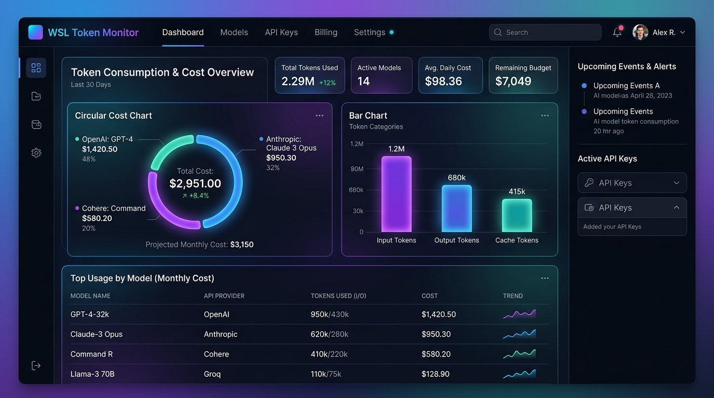

# WSL Token Monitor (Projeto Open-Source)

Um painel web moderno de código aberto (*open-source*) com visual *glassmorphic* e tema escuro projetado especificamente para rodar em ambientes WSL / Linux. O monitor escaneia de forma agregada os históricos locais de diferentes assistentes de IA (como CLI e IDE), consolidando o consumo de tokens e a estimativa de custos financeiros por projeto de software.

---

## 📸 Interface do Sistema



---

## 🚀 Principais Funcionalidades

* **Multi-Ferramentas (Modular)**: Suporta múltiplos assistentes de IA através de uma arquitetura de adaptadores no backend:
  * **Google Antigravity / AIOX**: Coleta automática de bancos de dados SQLite da CLI e da IDE.
  * **Claude Code**: Estrutura pronta para capturar arquivos de sessão de log em formato JSON.
  * **Aider CLI**: Escaneamento recursivo e estimativa de tokens a partir do arquivo `.aider.chat.history.md` nos seus projetos.
* **Inicialização Automática com o Sistema**: Configurado como um serviço de usuário do `systemd` para iniciar junto com o WSL / Linux.
* **Consolidação Financeira**: Agrupa custos por projeto e por modelo de IA com base em tabelas de preços customizáveis.
* **Gráficos Dinâmicos**: Visualização interativa utilizando Chart.js para distribuição de custos por projeto e consumo de tokens.

---

## 📁 Estrutura de Arquivos

* [server.js](file:///home/abnerfc01/src/token-monitor/server.js): Servidor REST backend em Node.js (Express).
* [db_reader.py](file:///home/abnerfc01/src/token-monitor/db_reader.py): Script em Python estruturado em **Adaptadores** para decodificar Protobuf e extrair estatísticas de várias IAs.
* [package.json](file:///home/abnerfc01/src/token-monitor/package.json): Dependências do projeto e scripts npm.
* [public/](file:///home/abnerfc01/src/token-monitor/public/): Frontend da aplicação (HTML, CSS e JavaScript).
* [docs/manual.md](file:///home/abnerfc01/src/token-monitor/docs/manual.md): Manual detalhado de implantação, funcionamento e guia explicativo da interface web.
* [docs/guide.md](file:///home/abnerfc01/src/token-monitor/docs/guide.md): Guia técnico explicando o banco de dados interno e regras de agregação.

---

## 🛠️ Como Iniciar e Configurar

### 1. Instalação e Configuração Automática
Navegue até a pasta do projeto, instale as dependências e execute o script de configuração:
```bash
cd /home/abnerfc01/src/token-monitor
npm install
npm run setup
```
O comando `npm run setup` irá:
* Detectar o diretório de instalação e o executável do Node.js de forma dinâmica.
* Gerar e registrar o serviço `token-monitor.service` no `systemd` do usuário.
* Criar uma cópia do arquivo `.env` para você personalizar caso necessário.
* Iniciar o serviço em segundo plano habilitado para boot automático.

### 2. Configurações Avançadas (.env)
Você pode personalizar o comportamento do monitor no arquivo `.env` gerado no diretório raiz:
* `PORT`: Altera a porta do servidor web (Padrão: `3030`).
* `PROJECTS_ROOT`: Caminho base para buscar projetos do Aider CLI (Padrão: `~/src`).
* `ADDITIONAL_CONVERSATIONS_DIRS`: Lista de pastas separadas por vírgula contendo históricos (`.db`) de outras máquinas (ex: diretórios sincronizados via Dropbox, OneDrive ou mounts de rede).

---

## 🌐 Como Acessar

Com o serviço rodando, abra o navegador no Windows e acesse:
👉 **[http://localhost:3030](http://localhost:3030)**

---

## 📖 Manual de Uso da Interface

### 1. Cadastro e Mapeamento de Projetos
Para agrupar o consumo de tokens corretamente, o monitor associa o histórico das conversas às pastas dos seus projetos locais.
1. Vá até a aba **Projetos Cadastrados** na barra lateral.
2. Informe o **Nome do Projeto** (ex: `Prima Invest`) e o **Caminho absoluto no WSL** (ex: `/home/abnerfc01/src/prisma_invest`).
3. **Mapeamento Automático (Sugestões)**: O monitor analisa seu histórico de conversas com IA e exibe pastas ativas não cadastradas na parte inferior da página. Basta clicar em **"Mapear como Projeto"** ao lado de qualquer pasta sugerida para registrá-la instantaneamente.

### 2. Dashboard e Filtros
A aba **Dashboard** apresenta resumos gerais:
* **Filtros Globais**: Na parte superior, você pode selecionar múltiplos projetos e modelos de IA para filtrar todos os custos e gráficos de forma síncrona.
* **Gráfico de Custos**: Exibe a fatia financeira que cada projeto representa no seu consumo total.
* **Gráfico de Barras**: Detalha os tokens de Entrada, Saída e Cache Hit utilizados por modelo de IA.

### 3. Ajuste de Tarifas Financeiras (Configurar Preços)
Na aba **Configurar Preços**, você pode editar a tarifa cobrada por milhão (1M) de tokens em dólares (USD) para cada modelo:
* Edite os campos numéricos de entrada, saída ou cache de qualquer modelo mapeado e clique em **Salvar Alterações de Preço**. Os custos anteriores serão recalculados dinamicamente com base nas novas regras.
* Clique em **Restaurar Valores Padrão** se desejar voltar aos preços oficiais de tabela (provedores como Anthropic e Google Gemini).

### 4. Histórico Detalhado
Na aba **Histórico de Uso**:
1. Veja todas as conversas registradas no sistema organizadas por data de última modificação.
2. Use o filtro de busca rápida para localizar conversas.
3. Clique em **🔍 Detalhes** de qualquer conversa para abrir um painel flutuante que exibe a listagem completa de todas as interações daquela conversa, incluindo o modelo, tokens consumidos e o custo estimado de cada passo individual.

---

## 💻 Suporte a Múltiplas Máquinas e Usuários

* **Caminhos Dinâmicos**: O monitor utiliza expansão dinâmica de caminhos (`~`) para resolver a pasta home de qualquer usuário no Linux/WSL.
* **Consolidação de Múltiplos WSLs / Computadores**: Copie os bancos de dados `.db` das conversas do AIOX/Antigravity de outros computadores para uma pasta local e insira o caminho na variável `ADDITIONAL_CONVERSATIONS_DIRS` do seu `.env`.
* **Fuzzy Matching por Nome do Projeto (Basename)**: Se o caminho do projeto mudar entre diferentes máquinas (ex: `/home/user1/src/meu-app` e `/Users/user2/meu-app`), o monitor usará o nome da pasta final (`meu-app`) para agrupar as estatísticas automaticamente.

---

## 🔄 Gerenciando o Serviço no WSL

Use os seguintes comandos no terminal do WSL para controlar o monitor de tokens:

* **Status do serviço**: `systemctl --user status token-monitor`
* **Parar o serviço**: `systemctl --user stop token-monitor`
* **Reiniciar o serviço**: `systemctl --user restart token-monitor`
* **Ver logs em tempo real**: `journalctl --user -u token-monitor -f`
* **Desativar a inicialização automática no boot**: `systemctl --user disable token-monitor`

---

## 📄 Licença e Código Aberto

Este é um projeto **open-source** (código aberto) distribuído sob a licença **ISC**. Sinta-se à vontade para utilizar, modificar, distribuir e enviar contribuições para melhoria do monitor.
