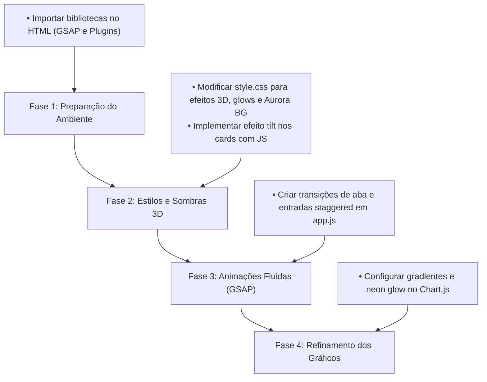

# Análise de Design & Oportunidades de Melhoria: WSL Token Monitor

Esta análise examina a interface atual do [token-monitor](file:///home/abner/code/token-monitor/public/index.html) sob a perspectiva do **Antigravity Design Expert**, com o objetivo de elevar a interface a um patamar super premium, aplicando fluidez espacial, profundidade 3D, efeitos ricos de vidro (glassmorphism) e micro-interações envolventes.

---

## 🎨 O Estado Atual do Design

O painel atual já possui boas bases para uma estética moderna:
- **Cores Acertadas:** Uso de roxos e cianos vibrantes (`#9b5de5`, `#00f5d4`) em contraste com um fundo escuro radial.
- **Glassmorphism Básico:** A classe `.glass` aplica `backdrop-filter: blur(16px)` e bordas semi-transparentes de forma consistente.
- **Estrutura Limpa:** Layout de duas colunas (Sidebar + Main) muito bem organizado.

No entanto, a interface atual é essencialmente **estática** e **bidimensional**. Ela não aproveita o potencial de profundidade espacial, animações fluidas ou micro-interações avançadas que caracterizam a experiência *Antigravity*.

---

## 🚀 Oportunidades de Melhoria (Princípios Antigravity)

### 1. Profundidade Espacial & Efeitos 3D (Spatial Depth & Mouse Tilt)
Atualmente, os cards e gráficos estão assentados rigidamente no plano da tela. Podemos introduzir profundidade física usando transformações tridimensionais baseadas na posição do mouse.

*   **Efeito Tilt 3D nos Cards de KPI:** Ao passar o mouse sobre os cards de KPI ou os containers de gráfico, eles devem rotacionar suavemente nos eixos X e Y (`rotateX` e `rotateY`), acompanhando a direção do cursor.
*   **Layering no Eixo Z:** Elementos internos do card (como o ícone de emoji e o valor monetário) devem ter `transform: translateZ(20px)` ou `translateZ(40px)` para parecer que se descolam fisicamente do painel de vidro de fundo ao interagir.
*   **Perspectiva Isométrica Opcional:** Criar uma chave de visualização que incline o dashboard inteiro levemente em um ângulo isométrico 3D (`transform: rotateX(20deg) rotateY(-15deg)`), criando uma mesa de comando espacial impressionante.

### 2. Glassmorphism Avançado (Rich Glassmorphism)
O efeito de vidro atual pode ser enriquecido para parecer mais premium e realista:
*   **Bordas Luminosas Reativas:** Em vez de uma borda cinza semi-transparente estática, podemos usar gradientes lineares nas bordas que acendem ou mudam de cor ao passar o mouse.
*   **Fundo Aurora Dinâmico:** Adicionar elementos flutuantes de fundo desfocados (auroras coloridas de roxo e ciano) que se movem de forma orgânica e sutil atrás do painel. Isso dá ao `backdrop-filter: blur` do painel um efeito de distorção translúcida espetacular à medida que as cores do fundo passam por trás dele.

### 3. Movimento Fluido & Entrada Escalonada (GSAP Animations)
Atualmente, as abas mudam usando uma animação simples de `@keyframes fadeIn` que move o bloco 10px para cima. Podemos tornar isso consideravelmente mais fluido e premium usando **GSAP (GreenSock Animation Platform)**:
*   **Staggered Entrances (Entradas em Cascata):** Ao carregar o dashboard ou alternar abas, os cards de KPI, os filtros e os gráficos não devem aparecer juntos. Eles devem deslizar de baixo com um leve efeito elástico (`ease: "power4.out"`) de forma escalonada, um após o outro (com atrasos de `0.05s` a `0.1s`).
*   **Transição de Abas em Arco:** A transição de conteúdo pode envolver um leve zoom-out seguido de uma rotação 3D sutil na saída, e um zoom-in com rotação na entrada, simulando a troca física de painéis holográficos.

### 4. Gráficos Premium com Gradientes e Neon
Os gráficos do Chart.js atualmente usam cores sólidas de preenchimento (`#9b5de5`, `#f15bb5`, etc.). Podemos torná-los muito mais integrados à estética glassmorphism:
*   **Gradientes Dinâmicos de Canvas:** Configurar o preenchimento das áreas de linha e barras com gradientes lineares que vão do roxo/ciano neon para transparente.
*   **Linhas de Brilho (Neon Lines):** Adicionar sombras de brilho (`shadowBlur` e `shadowColor`) nas linhas do gráfico de séries temporais para simular feixes de neon acesos.

---

## 🛠️ Plano de Implementação Proposto

Se você desejar avançar, podemos implementar estas melhorias divididas nas seguintes etapas:



### 📦 Mudanças Técnicas Necessárias

#### 1. Importação da Biblioteca GSAP no [index.html](file:///home/abner/code/token-monitor/public/index.html)
Adicionar o CDN do GSAP antes do `app.js`:
```html
<script src="https://cdnjs.cloudflare.com/ajax/libs/gsap/3.12.2/gsap.min.js"></script>
```

#### 2. Criação do Efeito de Fundo Aurora no [style.css](file:///home/abner/code/token-monitor/public/style.css)
Adicionar círculos de aurora desfocados flutuantes no HTML/CSS para dar profundidade:
```css
/* Elementos de Brilho Flutuantes (Aurora) */
.aurora-bg {
  position: fixed;
  width: 100vw;
  height: 100vh;
  top: 0;
  left: 0;
  z-index: -1;
  overflow: hidden;
  pointer-events: none;
}
.aurora-blob {
  position: absolute;
  border-radius: 50%;
  filter: blur(100px);
  opacity: 0.15;
  animation: float 20s infinite alternate ease-in-out;
}
.aurora-blob-1 {
  width: 400px;
  height: 400px;
  background: var(--primary);
  top: -100px;
  right: -100px;
}
.aurora-blob-2 {
  width: 500px;
  height: 500px;
  background: var(--secondary);
  bottom: -150px;
  left: -150px;
  animation-duration: 25s;
}

@keyframes float {
  0% { transform: translate(0, 0) scale(1); }
  100% { transform: translate(80px, 50px) scale(1.1); }
}
```

#### 3. Efeito Interactive 3D Tilt no [app.js](file:///home/abner/code/token-monitor/public/app.js)
Implementar uma função que capture o movimento do mouse nos KPI cards e altere dinamicamente a propriedade `transform` baseando-se no ângulo:
```javascript
function applyTiltEffect() {
  const cards = document.querySelectorAll('.kpi-card, .chart-container');
  cards.forEach(card => {
    card.addEventListener('mousemove', e => {
      const rect = card.getBoundingClientRect();
      const x = e.clientX - rect.left; // coordenada X dentro do card
      const y = e.clientY - rect.top;  // coordenada Y dentro do card
      
      const centerX = rect.width / 2;
      const centerY = rect.height / 2;
      
      // Calcula a rotação (-10 a 10 graus)
      const rotateX = ((centerY - y) / centerY) * 8;
      const rotateY = ((x - centerX) / centerX) * 8;
      
      card.style.transform = `perspective(1000px) rotateX(${rotateX}deg) rotateY(${rotateY}deg) translateY(-4px)`;
    });
    
    card.addEventListener('mouseleave', () => {
      card.style.transform = 'perspective(1000px) rotateX(0deg) rotateY(0deg) translateY(0)';
    });
  });
}
```

---

## 🎯 Próximo Passo Recomendado

Gostaria que eu comece a aplicar essas melhorias na interface do **token-monitor**? 

Se você aprovar, farei as alterações de forma segura nos arquivos do frontend:
1. Adicionando o script do GSAP no [index.html](file:///home/abner/code/token-monitor/public/index.html).
2. Adicionando os estilos de Aurora, transições 3D e refinamento de sombras no [style.css](file:///home/abner/code/token-monitor/public/style.css).
3. Atualizando o [app.js](file:///home/abner/code/token-monitor/public/app.js) com as animações de entrada GSAP, efeitos de tilt interativo e gradientes dinâmicos no Chart.js.
