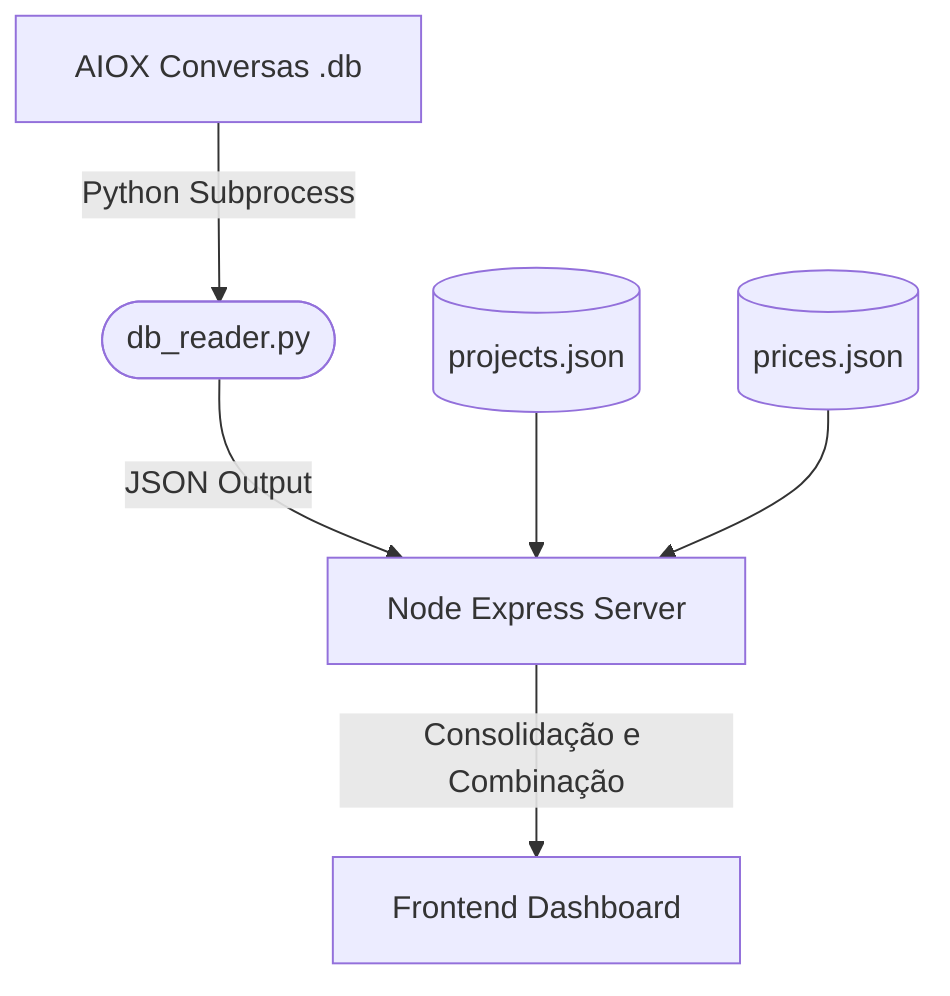

# Guia Técnico: WSL Token Monitor (Projeto Open-Source)

Desenvolvemos uma aplicação open-source em Node.js (Express) com frontend em HTML/CSS/JS e um leitor em Python que vasculha as conversações locais do AIOX e consolida o consumo de tokens e a estimativa de custos por projeto.

## Estrutura do Projeto

1. **Leitor de Banco de Dados**: `db_reader.py`
   - Um script Python que lê e decodifica via Protobuf as estatísticas de geração contidas nas tabelas SQLite do AIOX (`gen_metadata` e `trajectory_metadata_blob`). Ele extrai os tokens de entrada, saída, cached hit, modelo utilizado e data/hora.
2. **Servidor Backend**: `server.js`
   - Um servidor Express simples que executa o script Python, faz a consolidação do consumo de tokens por diretório de projeto e gerencia os cadastros.
3. **Configuração de Dependências**: `package.json`
   - Define a dependência do `express` e comandos para rodar o app.
4. **Layout Frontend**: `public/index.html`
   - Uma interface moderna que apresenta KPIs globais, gráficos estatísticos e abas de navegação.
5. **Estilização Glassmorphism**: `public/style.css`
   - Tema escuro de alta fidelidade visual com cartões translúcidos (efeito de vidro), transições suaves e design totalmente responsivo.
6. **Lógica Cliente-side**: `public/app.js`
   - Integra-se com as APIs REST locais, renderiza os gráficos de custos e de tokens usando a biblioteca Chart.js, gerencia formulários e exibe detalhes de conversas específicas em um modal interativo.

---

## Como Funciona a Extração de Dados

O AIOX grava o histórico das suas conversas e execuções em bancos de dados SQLite individuais no diretório `~/.gemini/antigravity-cli/conversations/`. 

O `db_reader.py` vasculha essa pasta e recupera:
* **Workspace**: A URL do repositório/pasta do projeto ativo (gravada na tabela `trajectory_metadata_blob`).
* **Tokens**: A quantidade exata de tokens processados por passo na tabela `gen_metadata` (mapeando campos binários do Protobuf para entrada, saída e cache hit).
* **Modelo**: Identificação do modelo (como `Gemini 3.5 Flash (Medium)` ou `Claude Sonnet 4.6 (Thinking)`).

O backend em `server.js` correlaciona os workspaces locais dos bancos de dados com os caminhos dos projetos que você cadastrou no painel.

---

## Como Acessar a Interface

O servidor já está sendo executado em segundo plano e você pode abri-lo diretamente no navegador no endereço:

👉 **[http://localhost:3030](http://localhost:3030)**

---

## Funcionalidades Incluídas

### 1. Painel Geral (Dashboard)
* **Cartões de KPI**: Mostram o Custo Total Estimado (em USD), total de tokens de Entrada, tokens salvos via Prompt Cache (Hit) e tokens de Saída.
* **Gráficos Visuais**:
  * Distribuição percentual de custo financeiro por projeto (gráfico de rosca).
  * Consumo detalhado de tokens (Entrada vs. Saída vs. Cache) por modelo de IA utilizado (gráfico de barras).
* **Tabela Geral**: Um detalhamento consolidado com o total de tokens e custos de cada pasta ativa.

### 2. Mapeamento Inteligente de Projetos
* Você pode cadastrar o nome e o caminho absoluto da pasta local (ex: `/home/<user>/src/resumeai` ou `~/src/resumeai`).
* **Sugestões de Cadastro**: O painel classifica e exibe na parte inferior da página uma lista de pastas ativas não cadastradas. Basta clicar no botão **"Mapear como Projeto"** para cadastrar essa pasta rapidamente.

### 3. Configuração de Tarifas de Preço
* Permite ajustar os valores de custo por milhão de tokens (Input, Input Cached Hit, Output) para cada modelo listado. Os preços padrão vêm predefinidos de acordo com as tabelas vigentes (Gemini, Claude, GPT).

### 4. Histórico Detalhado
* Lista todas as conversas registradas ordenadas pela última modificação.
* Um botão de **Detalhes** abre um modal flutuante que disseca aquela conversa específica, mostrando o custo e consumo de tokens passo a passo (cada prompt enviado e resposta recebida).
